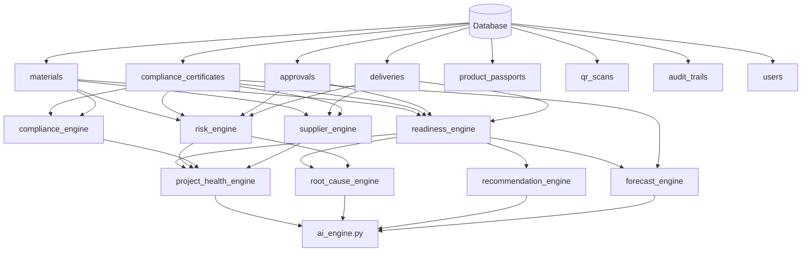

# ConstructAsk V3 — Data Lineage Map

Every visible number in the UI is traced to its database source, API endpoint, and calculation method.

**Zero hardcoded values.** Every metric is computed from live database data.

---

## 1. Dashboard (CommandCenter)

### 1.1 Project Readiness Score
```
UI Widget: Readiness % badge
→ API: GET /api/projects/{id}/readiness
→ Engine: engines/readiness_engine.py → compute_readiness_score()
→ Formula: materials×30% + certificates×30% + approvals×20% + deliveries×20%
→ Tables: materials, compliance_certificates, approvals, deliveries
```

### 1.2 Risk Level Badge
```
UI Widget: Risk Level (High/Medium/Low)
→ API: GET /api/projects/{id}/dashboard
→ Engine: engines/risk_engine.py → compute_risk_assessment()
→ Logic: High if (expired_certs OR failed_materials OR ≥2 overdue_approvals OR delay≥4d)
→ Tables: materials, compliance_certificates, approvals, deliveries
```

### 1.3 Materials KPI
```
UI Widget: Materials % verified
→ API: GET /api/materials/?project_id={id}
→ Calculation: count(status='verified') / count(all) × 100
→ Table: materials (columns: id, project_id, status)
```

### 1.4 Compliance KPI
```
UI Widget: Compliance %
→ API: GET /api/compliance/?project_id={id}
→ Engine: engines/compliance_engine.py → compute_compliance_status()
→ Calculation: count(valid_certs) / count(all_certs) × 100
→ Table: compliance_certificates (columns: id, material_id, expiry_date, status)
```

### 1.5 Approvals KPI
```
UI Widget: Approvals %
→ API: GET /api/approvals/?project_id={id}
→ Calculation: count(status='approved') / count(all) × 100
→ Table: approvals (columns: id, project_id, status, requested_date, approved_date)
```

### 1.6 Deliveries KPI
```
UI Widget: Deliveries %
→ API: GET /api/projects/{id}/dashboard
→ Engine: engines/readiness_engine.py (delivery component)
→ Calculation: count(on_time) / count(all) × 100
→ Table: deliveries (columns: id, project_id, expected_date, actual_date, delay_days)
```

### 1.7 Executive Brief
```
UI Widget: 5 brief items
→ API: GET /api/projects/{id}/dashboard (executive_brief field)
→ Engine: engines/project_health_engine.py → compute_project_health()
→ Tables: ALL project tables aggregated
```

---

## 2. Product Passports (ProductPassports.tsx)

### 2.1 Passport List
```
UI Widget: Passport cards with compliance/carbon scores
→ API: GET /api/passports/?project_id={id}
→ Table: product_passports (columns: id, material_id, compliance_score, carbon_score, status)
```

### 2.2 Passport Detail
```
UI Widget: Full passport with material, certs, approvals, scan context
→ API: GET /api/passports/{id}
→ Tables: product_passports + materials + compliance_certificates + approvals + qr_scans
```

---

## 3. Compliance Hub (ComplianceHub.tsx)

### 3.1 Certificate List
```
UI Widget: Certificate table with status badges
→ API: GET /api/compliance/?project_id={id}
→ Engine: intelligence.py → certificate_status() per cert
→ Table: compliance_certificates
```

### 3.2 Approval Workflow
```
UI Widget: Approval cards with overdue days
→ API: GET /api/approvals/?project_id={id}
→ Engine: intelligence.py → approval_overdue_days() per approval
→ Table: approvals
```

---

## 4. Audit Trail (AuditTrail.tsx)

```
UI Widget: Blockchain-style audit log with hash chain
→ API: GET /api/projects/{id}/audit-trail
→ Engine: engines/audit_engine.py → verify_chain_integrity()
→ Table: audit_trails (columns: id, action, timestamp, hash, previous_hash, project_id)
→ Hash: SHA256(previous_hash + action + timestamp + entity_id)
```

---

## 5. Scan Log (ScanLog.tsx)

```
UI Widget: QR scan history table
→ API: GET /api/materials/scans/all?project_id={id}
→ Table: qr_scans (columns: id, material_id, scanned_by, scan_time, location, result)
```

---

## 6. Supplier Health

```
UI Widget: Supplier performance cards with reliability %
→ API: GET /api/projects/{id}/dashboard (supplier_risk field)
→ Engine: engines/supplier_engine.py → analyze_suppliers()
→ Calculation: (on_time_deliveries / total_deliveries) × 100
→ Tables: materials (supplier column) + deliveries (supplier, delay_days)
```

---

## 7. AI Intelligence (EvidenceAssistant.tsx)

```
UI Widget: AI chat responses with follow-up buttons
→ API: POST /api/chat/
→ Engine: ai_engine.py → ask_constructask()
→ Sub-engines:
  - engines/readiness_engine.py
  - engines/risk_engine.py
  - engines/root_cause_engine.py
  - engines/recommendation_engine.py
  - engines/forecast_engine.py
  - engines/compliance_engine.py
  - engines/supplier_engine.py
  - engines/project_health_engine.py
→ Tables: ALL project tables
```

---

## Engine Dependency Map


